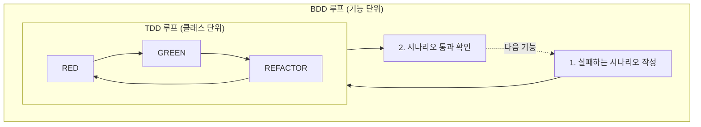
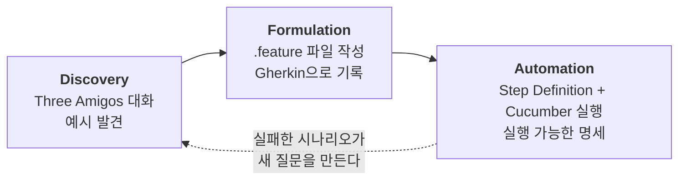
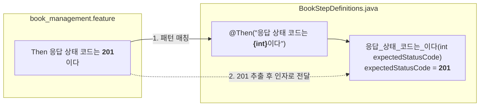
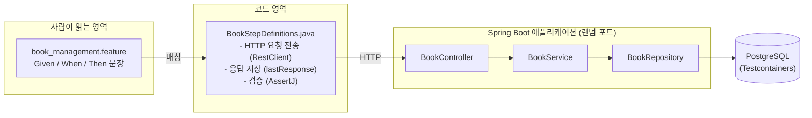

# 01. BDD와 Cucumber 핵심 개념

> **이 글에서 배울 것**
> - BDD가 어떤 문제를 해결하려고 등장했는가
> - BDD의 3단계(Discovery, Formulation, Automation)
> - Cucumber가 Gherkin 문장을 실행 가능한 테스트로 바꾸는 원리
> - 앞으로 계속 등장할 핵심 용어
>
> **선수 지식**: JUnit으로 테스트를 한 번이라도 작성해본 경험

---

## 1. 왜 BDD가 필요할까? — 흔한 실패 이야기

기획자가 이렇게 요구사항을 전달했다고 해봅시다.

> "같은 ISBN의 책은 중복으로 등록할 수 없게 해주세요."

개발자는 기능을 만들고 테스트도 작성했습니다. 그런데 배포 후 이런 질문들이 쏟아집니다.

- 중복이면 **어떤 응답**을 줘야 하나요? 400? 409?
- 하이픈이 빠진 ISBN(`9780132350884`)과 하이픈이 있는 ISBN(`978-0132350884`)은 같은 책인가요?
- 삭제된 책과 같은 ISBN으로 다시 등록하는 건 되나요?

문제는 **코드가 아니라 대화**에 있었습니다. 요구사항이 추상적인 문장으로만 오갔기 때문에,
각자 머릿속에 서로 다른 "구체적인 예시"를 그리고 있었던 것입니다.

BDD는 이 문제를 이렇게 풉니다.

> **추상적인 규칙 대신 구체적인 예시(Example)로 대화하고,
> 그 예시를 그대로 실행 가능한 테스트로 만든다.**

```gherkin
Scenario: 중복 ISBN으로 도서를 등록하면 실패한다
  Given ISBN "978-0132350884"인 도서가 이미 등록되어 있다
  When ISBN "978-0132350884"로 다른 도서를 등록하려 한다
  Then 응답 상태 코드는 409이다
```

이 시나리오는 기획자도 읽을 수 있고, 동시에 `./gradlew test`로 실행되는 테스트입니다.
위 예시는 이 프로젝트의 `book_management.feature`에 실제로 들어 있습니다.

---

## 2. BDD란?

**BDD(Behavior-Driven Development, 행동 주도 개발)** 는 소프트웨어가 "사용자 관점에서 어떻게 행동해야 하는가"를
구체적인 예시로 합의하고, 그 예시를 개발과 테스트의 기준으로 삼는 협업 방법론입니다.

### TDD와 무엇이 다른가?

BDD는 TDD에서 출발했지만 초점이 다릅니다.

| 구분 | TDD | BDD |
|------|-----|-----|
| 질문 | "이 코드가 올바르게 동작하는가?" | "이 시스템이 사용자에게 올바르게 행동하는가?" |
| 단위 | 클래스, 메서드 | 기능, 사용자 시나리오 |
| 언어 | 프로그래밍 언어 (JUnit 코드) | 자연어 (Gherkin) + 프로그래밍 언어 |
| 독자 | 개발자 | 개발자, 기획자, QA, 운영자 모두 |
| 대표 도구 | JUnit, Mockito | Cucumber, SpecFlow, Behave |

둘은 경쟁 관계가 아닙니다. 일반적으로 **바깥 루프는 BDD(시나리오)**, **안쪽 루프는 TDD(단위 테스트)** 로 함께 사용합니다.



---

## 3. BDD의 3단계

Cucumber 공식 문서는 BDD를 세 가지 활동으로 설명합니다. **Cucumber는 이 중 마지막 단계만 담당하는 도구**라는 점을 기억하세요.

### 3.1 Discovery (발견) — "무엇을 만들어야 하지?"

기획자(비즈니스), 개발자, 테스터가 함께 모여 구체적인 예시를 찾는 단계입니다.
이 세 역할의 대화를 **Three Amigos(세 친구)** 라고 부릅니다.

대표적인 기법이 **Example Mapping** 입니다. 색깔이 다른 카드 네 종류로 대화를 정리합니다.

| 카드 | 의미 | 도서 등록 기능 예시 |
|------|------|---------------------|
| 노란색 (Story) | 다룰 사용자 스토리 | 관리자는 새 도서를 등록할 수 있다 |
| 파란색 (Rule) | 비즈니스 규칙 | ISBN은 중복될 수 없다 / 가격은 0보다 커야 한다 |
| 초록색 (Example) | 규칙을 보여주는 구체적 예시 | 이미 "978-0132350884"가 있으면 같은 ISBN 등록은 거절된다 |
| 빨간색 (Question) | 아직 답이 없는 질문 | 하이픈 없는 ISBN도 같은 책으로 볼까? |

빨간 카드가 많이 남았다면 아직 개발을 시작할 때가 아니라는 신호입니다.

### 3.2 Formulation (정형화) — "예시를 어떻게 적지?"

찾아낸 예시를 **Gherkin**이라는 구조화된 자연어로 문서화합니다.
누구나 읽을 수 있으면서도 기계가 해석할 수 있는 형식입니다.

### 3.3 Automation (자동화) — "예시를 어떻게 검증하지?"

Gherkin 문서를 **Cucumber**가 읽어서, 각 문장에 연결된 코드(Step Definition)를 실행합니다.
이렇게 하면 문서가 곧 테스트가 되고, 시스템 동작이 바뀌면 문서(테스트)가 실패해서 알려줍니다.
그래서 Gherkin 문서를 **살아있는 문서(Living Documentation)** 라고 부릅니다.



---

## 4. Cucumber는 어떻게 동작할까?

Cucumber가 하는 일은 생각보다 단순합니다. **"문장을 찾아서, 맞는 메서드를 호출한다"** 가 전부입니다.



실행 과정을 조금 더 풀어보면 다음과 같습니다.

1. `.feature` 파일을 읽고 Gherkin 문법으로 **파싱**합니다.
2. 각 Scenario의 Step(문장) 하나하나에 대해, 등록된 Step Definition의 **패턴과 비교**합니다.
3. 정확히 하나가 매칭되면, 문장에서 추출한 값(`201`)을 인자로 그 **메서드를 호출**합니다.
4. 메서드가 예외 없이 끝나면 Step **통과**, 예외(예: AssertJ 검증 실패)가 나면 **실패**입니다.
5. 한 Step이 실패하면 같은 Scenario의 나머지 Step은 **건너뜁니다(skipped)**.
6. 모든 결과를 리포트(콘솔, HTML, JSON 등)로 출력합니다.

매칭되는 메서드가 없으면 **Undefined**, 두 개 이상이면 **Ambiguous** 오류가 납니다.
이 두 오류는 Cucumber 초보자가 가장 자주 만나는 오류이며, [08. 트러블슈팅](troubleshooting.md)에서 다룹니다.

### Step의 실행 결과 상태

| 상태 | 의미 |
|------|------|
| passed | 메서드가 정상 종료됨 |
| failed | 메서드에서 예외(검증 실패 포함)가 발생함 |
| skipped | 앞 Step이 실패해서 실행되지 않음 |
| undefined | 매칭되는 Step Definition이 없음 |
| pending | Step Definition이 `PendingException`을 던짐 (아직 구현 중이라는 표시) |
| ambiguous | 매칭되는 Step Definition이 둘 이상 |

---

## 5. Cucumber를 쓸 때 흔한 오해

| 오해 | 사실 |
|------|------|
| "Cucumber는 테스트 자동화 도구다" | Cucumber는 **협업과 명세**를 위한 도구이고, 자동화는 그 수단입니다. 아무도 읽지 않는 `.feature` 파일은 비싼 JUnit 테스트일 뿐입니다. |
| "모든 테스트를 Cucumber로 작성해야 한다" | 비즈니스 규칙과 사용자 행동만 Cucumber로 쓰고, 세부 로직은 단위 테스트로 검증하는 것이 일반적입니다. |
| "Cucumber는 UI 테스트용이다" | 이 프로젝트처럼 REST API, 서비스 레이어, 심지어 도메인 객체 수준에서도 사용할 수 있습니다. |
| "Gherkin에는 구체적인 클릭 순서를 다 적어야 한다" | 오히려 반대입니다. **무엇(What)** 을 적고, **어떻게(How)** 는 Step Definition에 숨깁니다. ([06. 좋은 시나리오 작성법](writing-good-scenarios.md)) |

---

## 6. 핵심 용어 정리

앞으로 모든 문서에서 이 용어들을 사용합니다.

| 용어 | 설명 | 이 프로젝트의 예 |
|------|------|------------------|
| **Gherkin** | 시나리오를 작성하는 구조화된 자연어 문법 | `.feature` 파일의 문법 |
| **Feature 파일** | Gherkin으로 작성된 `.feature` 확장자 파일 | `src/test/resources/features/book_management.feature` |
| **Feature** | 하나의 기능 단위. 파일당 하나 | `Feature: 도서 관리` |
| **Scenario** | 기능의 구체적인 예시 하나 = 테스트 케이스 하나 | `Scenario: 도서를 삭제한다` |
| **Step** | Scenario를 구성하는 한 줄 (`Given`/`When`/`Then`...) | `When 해당 도서를 삭제한다` |
| **Step Definition** | Step과 매칭되어 실제로 실행되는 메서드 | `@When("해당 도서를 삭제한다") public void ...` |
| **Glue** | Step Definition과 Hook이 들어 있는 코드 묶음(패키지) | `com.example.cucumber` 패키지 |
| **Cucumber Expression** | Step Definition의 매칭 패턴 문법 | `"응답 상태 코드는 {int}이다"` |
| **Hook** | Scenario 전후에 자동 실행되는 메서드 | `@Before public void setUp()` |
| **Tag** | Scenario 분류용 라벨. 선택 실행에 사용 | `@smoke` |
| **Runner** | Cucumber를 실행시키는 진입점 | `CucumberIntegrationTest` |

---

## 7. 이 프로젝트에서의 전체 그림



즉, 이 프로젝트의 시나리오는 **실제 서버를 띄우고 실제 DB를 사용하는 인수 테스트(Acceptance Test)** 입니다.

---

## 확인 문제

<details>
<summary>Q1. BDD의 3단계 중 Cucumber가 직접 담당하는 단계는?</summary>

**Automation(자동화)**. Discovery와 Formulation은 사람 사이의 대화와 작성 활동이며, Cucumber는 작성된 Gherkin을 실행하는 역할을 합니다.
</details>

<details>
<summary>Q2. 한 Scenario의 두 번째 Step이 실패하면 세 번째 Step은 어떻게 되나요?</summary>

실행되지 않고 **skipped** 상태가 됩니다. 다음 Scenario는 정상적으로 실행됩니다.
</details>

<details>
<summary>Q3. Example Mapping에서 빨간 카드(Question)가 많이 남았다는 것은 무엇을 의미하나요?</summary>

요구사항에 대한 합의가 아직 부족하다는 뜻입니다. 시나리오를 쓰거나 개발을 시작하기 전에 질문부터 해소해야 합니다.
</details>

---

| 이전 글 | 목차 | 다음 글 |
|:---|:---:|---:|
| [← README (프로젝트 소개)](../README.md) | [학습 로드맵](../README.md#학습-로드맵) | [02. Gherkin 기초 문법 →](gherkin-basics.md) |
