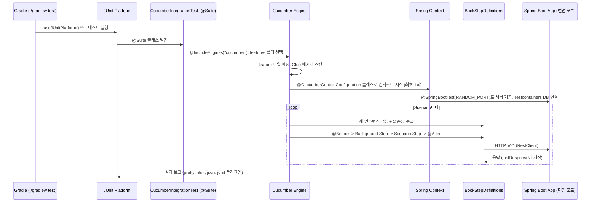
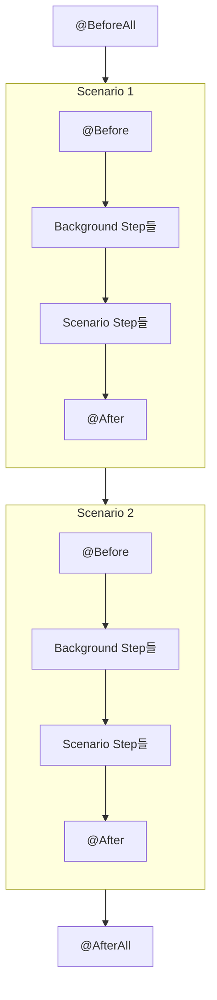

# 05. 프로젝트 구조와 실행 원리

> **이 글에서 배울 것**
> - `./gradlew test` 한 줄이 Scenario 실행으로 이어지는 전체 흐름
> - Cucumber 관련 의존성 각각의 역할
> - `CucumberIntegrationTest`, `CucumberSpringConfiguration`이 하는 일
> - Spring 컨텍스트와 Step Definition 인스턴스의 생명주기
> - Hook(`@Before`, `@After` ...)의 종류와 실행 순서
> - Cucumber 설정, 특정 시나리오만 실행하기, 리포트
>
> **선수 지식**: [04. Step Definition 작성법](step-definitions.md)

---

## 1. 의존성 구성 (`build.gradle.kts`)

```kotlin
val cucumberVersion = "7.20.1"

testImplementation(platform("io.cucumber:cucumber-bom:$cucumberVersion"))
testImplementation("io.cucumber:cucumber-java")
testImplementation("io.cucumber:cucumber-spring")
testImplementation("io.cucumber:cucumber-junit-platform-engine")
testImplementation("org.junit.platform:junit-platform-suite")
```

| 의존성 | 역할 |
|--------|------|
| `cucumber-bom` | Cucumber 모듈들의 버전을 한 곳에서 맞춰주는 BOM. 개별 모듈에는 버전을 적지 않습니다. |
| `cucumber-java` | `@Given`/`@When`/`@Then`, `@Before`/`@After`, `@ParameterType` 등 Java 어노테이션 제공 |
| `cucumber-spring` | Step Definition을 Spring 빈으로 생성해서 `@Autowired`를 쓸 수 있게 해줌. `@CucumberContextConfiguration` 제공 |
| `cucumber-junit-platform-engine` | Cucumber를 **JUnit Platform의 테스트 엔진**으로 등록. Gradle/IntelliJ가 JUnit 테스트처럼 실행할 수 있게 됨 |
| `junit-platform-suite` | `@Suite` 어노테이션으로 "이 클래스를 실행하면 Cucumber 엔진으로 features 폴더를 돌려라"라고 지정할 수 있게 해줌 |
| `testcontainers:postgresql` | 테스트 동안 Docker로 실제 PostgreSQL을 띄움 |

---

## 2. 전체 실행 흐름



> 위 다이어그램은 GitHub에서 Mermaid로 렌더링됩니다. 텍스트로 요약하면:
> **Gradle → JUnit Platform → Suite 클래스 → Cucumber 엔진 → (최초 1회) Spring 컨텍스트 + Testcontainers → Scenario마다 Step Definition 실행**

---

## 3. 핵심 클래스 세 개

### 3.1 `CucumberIntegrationTest` — 실행 진입점

```java
@Suite                                                        // (1)
@IncludeEngines("cucumber")                                   // (2)
@SelectClasspathResource("features")                          // (3)
@ConfigurationParameter(key = GLUE_PROPERTY_NAME,
                        value = "com.example.cucumber")       // (4)
@ConfigurationParameter(key = PLUGIN_PROPERTY_NAME,
        value = "pretty," +
                "html:build/reports/cucumber/cucumber.html," +
                "json:build/reports/cucumber/cucumber.json," +
                "junit:build/reports/cucumber/cucumber.xml")  // (5)
public class CucumberIntegrationTest {
}
```

| 번호 | 의미 |
|:---:|------|
| (1) | 이 클래스는 테스트 메서드를 가진 클래스가 아니라 **테스트 묶음(Suite)** 이다 |
| (2) | 묶음을 실행할 엔진은 Cucumber다 (JUnit Jupiter 엔진이 아님) |
| (3) | 클래스패스의 `features` 폴더(= `src/test/resources/features`) 아래 `.feature` 파일을 실행한다 |
| (4) | Step Definition, Hook, ParameterType을 찾을 **Glue 패키지**. 하위 패키지(`steps`)까지 포함 |
| (5) | 결과를 출력할 플러그인. 콘솔(pretty), HTML, JSON, JUnit XML |

클래스 본문은 **비어 있어야** 합니다. 실행할 내용은 전부 `.feature` 파일에 있습니다.

### 3.2 `CucumberSpringConfiguration` — Cucumber와 Spring 연결

```java
@CucumberContextConfiguration                                       // (1)
@SpringBootTest(webEnvironment = SpringBootTest.WebEnvironment.RANDOM_PORT)  // (2)
@ActiveProfiles("test")                                             // (3)
@ContextConfiguration(initializers = CucumberSpringConfiguration.ContainerInitializer.class) // (4)
public class CucumberSpringConfiguration {

    static final PostgreSQLContainer<?> POSTGRES = new PostgreSQLContainer<>("postgres:16-alpine")...;

    static {
        POSTGRES.start();                                           // (5)
    }
    ...
}
```

| 번호 | 의미 |
|:---:|------|
| (1) | "Cucumber야, Spring 컨텍스트는 이 클래스의 설정으로 만들어라". Glue 패키지 안에 **정확히 하나**만 있어야 합니다. |
| (2) | 실제 내장 서버를 **랜덤 포트**로 띄웁니다. Step Definition은 `@LocalServerPort`로 포트를 받아 HTTP 요청을 보냅니다. |
| (3) | `application-test.yml`을 적용합니다. (Docker Compose 자동 실행 끄기 등) |
| (4) | 컨텍스트가 만들어지기 **전에** Testcontainers DB 접속 정보를 Spring Environment에 주입합니다. |
| (5) | `static` 블록에서 컨테이너를 한 번만 시작합니다. 모든 Scenario가 같은 DB를 공유합니다. |

### 3.3 `BookStepDefinitions` — Glue 코드

[04장](step-definitions.md#10-이-프로젝트의-bookstepdefinitions-읽는-법)에서 자세히 다뤘습니다.
여기서 중요한 점은 이 클래스가 **Spring 빈으로 생성되기 때문에** `@Autowired BookRepository`와 `@LocalServerPort`가 동작한다는 것입니다.

---

## 4. 생명주기: 무엇이 한 번 만들어지고, 무엇이 매번 만들어지나?

초보자가 가장 헷갈리는 부분입니다. 표로 정리하면 다음과 같습니다.

| 대상 | 생성 시점 | 공유 범위 | 결과 |
|------|-----------|-----------|------|
| PostgreSQL 컨테이너 | 테스트 JVM에서 최초 1회 (`static`) | 모든 Scenario | DB 데이터가 Scenario 사이에 **남는다** |
| Spring ApplicationContext / 내장 서버 | 최초 1회 (Spring 테스트 컨텍스트 캐시) | 모든 Scenario | 서버 기동 비용은 한 번만 든다 |
| `BookStepDefinitions` 인스턴스 | **Scenario마다** 새로 | 한 Scenario 안의 Step들 | 필드(`lastResponse`, `savedBookId`)는 Scenario 사이에 **남지 않는다** |

여기서 중요한 결론이 나옵니다.

> **Java 객체 상태는 자동으로 초기화되지만, DB 상태는 자동으로 초기화되지 않는다.**

그래서 이 프로젝트는 Background의 `도서 데이터베이스가 초기화되어 있다` Step에서 `bookRepository.deleteAll()`을 호출합니다.
이 Step을 빼면 앞 Scenario가 등록한 도서가 남아 `도서 목록에 3권이 포함되어 있다` 같은 검증이 실패하거나,
ISBN 중복(409)이 발생할 수 있습니다.

> **왜 `@Transactional` 롤백을 쓰지 않을까?**
> `RANDOM_PORT` 환경에서는 HTTP 요청이 **별도의 서버 스레드**에서 처리됩니다.
> 테스트 쪽 트랜잭션은 서버 쪽 트랜잭션과 무관하기 때문에 롤백해도 서버가 저장한 데이터는 지워지지 않습니다.
> 그래서 명시적으로 데이터를 정리하는 방식을 사용합니다.

---

## 5. Hook — Scenario 전후에 자동으로 실행되는 코드

### 5.1 Hook 종류

| 어노테이션 | 실행 시점 | 메서드 조건 | 주 용도 |
|------------|-----------|-------------|---------|
| `@BeforeAll` | 전체 실행 시작 시 1회 | `static` | 외부 리소스 준비 |
| `@AfterAll` | 전체 실행 종료 시 1회 | `static` | 외부 리소스 정리 |
| `@Before` | 각 Scenario 시작 전 | | 클라이언트 생성, 데이터 정리 |
| `@After` | 각 Scenario 종료 후 (**실패해도 실행**) | | 정리, 실패 시 디버깅 정보 첨부 |
| `@BeforeStep` | 각 Step 실행 전 | | 거의 쓰지 않음 |
| `@AfterStep` | 각 Step 실행 후 | | UI 테스트에서 스크린샷 |

모두 `io.cucumber.java` 패키지에 있습니다. (`io.cucumber.java.Before` — JUnit의 `@BeforeEach`와 혼동하지 마세요.)

### 5.2 실행 순서

Scenario 두 개짜리 Feature를 실행하면 순서는 다음과 같습니다.



> 각 Step(Background Step 포함)의 앞뒤에서는 `@BeforeStep` / `@AfterStep`이 실행됩니다.

- **Hook은 Background보다 먼저** 실행됩니다. 이 프로젝트에서 `@Before setUp()`이 `RestClient`를 만든 뒤에 Background Step이 실행되는 이유입니다.
- 같은 종류의 Hook이 여러 개면 `order` 속성으로 순서를 정합니다.
  `@Before`는 **작은 숫자부터**, `@After`는 **큰 숫자부터** 실행됩니다. (기본값 10000)
  ```java
  @Before(order = 1)  public void first()  { ... }
  @Before(order = 2)  public void second() { ... }
  ```

### 5.3 Tag가 붙은 Hook

Hook에 Tag Expression을 넘기면 해당 Tag가 붙은 Scenario에서만 실행됩니다.

```java
@Before("@database")
public void cleanDatabase() {
    bookRepository.deleteAll();
}

@After("not @readonly")
public void cleanup() { ... }
```

### 5.4 `Scenario` 객체 활용

Hook 메서드는 `io.cucumber.java.Scenario` 파라미터를 받을 수 있습니다.
실패한 Scenario의 마지막 응답 본문을 리포트에 남기는 것은 디버깅에 매우 유용합니다.

```java
@After
public void attachResponseOnFailure(Scenario scenario) {
    if (scenario.isFailed() && lastResponse != null) {
        scenario.log("마지막 응답 상태: " + lastResponse.getStatusCode());
        scenario.attach(String.valueOf(lastResponse.getBody()), "application/json", "last-response");
    }
}
```

이렇게 하면 HTML 리포트의 실패한 Scenario 아래에 응답 본문이 첨부됩니다. ([07장 실습](bdd-guide.md)에서 직접 추가해봅니다.)

| 메서드 | 설명 |
|--------|------|
| `getName()` | Scenario 이름 |
| `getSourceTagNames()` | 붙어 있는 Tag 목록 (상속 포함) |
| `isFailed()` | 지금까지 실패했는지 |
| `getStatus()` | 현재 상태 (`PASSED`, `FAILED` ...) |
| `log(String)` | 리포트에 텍스트 기록 |
| `attach(byte[] 또는 String, mediaType, name)` | 리포트에 파일/텍스트 첨부 |

---

## 6. 특정 시나리오만 실행하기

### 6.1 IntelliJ에서 실행 (가장 간편)

**Cucumber for Java** 플러그인을 설치하면 `.feature` 파일의 `Feature:`/`Scenario:` 옆에 실행 아이콘이 생깁니다.
Scenario 하나만 클릭해서 실행할 수 있습니다.

> 처음 실행 시 Glue가 설정되지 않아 `Undefined step`이 나오면,
> Run Configuration의 **Glue** 항목에 `com.example.cucumber`를 입력하세요.

### 6.2 Tag로 골라서 실행 (Gradle)

`cucumber.filter.tags` 설정에 Tag Expression을 넣으면 됩니다. 방법은 세 가지입니다.

**방법 A. Suite 클래스에 고정**

```java
@ConfigurationParameter(key = FILTER_TAGS_PROPERTY_NAME, value = "@smoke")
public class CucumberIntegrationTest {}
```

**방법 B. `junit-platform.properties`에 고정**

```properties
cucumber.filter.tags=not @wip
```

**방법 C. 명령줄에서 지정 (권장, 단 빌드 설정 필요)**

Gradle의 `-D` 옵션은 **Gradle 프로세스**의 시스템 프로퍼티일 뿐, 테스트가 실행되는 **별도 JVM**으로 자동 전달되지 않습니다.
따라서 현재 프로젝트 설정 그대로 `./gradlew test -Dcucumber.filter.tags=@smoke`를 실행하면 **필터가 적용되지 않습니다.**
다음과 같이 전달 코드를 `build.gradle.kts`에 추가해야 합니다.

```kotlin
tasks.withType<Test> {
    useJUnitPlatform()
    systemProperty("cucumber.junit-platform.naming-strategy", "long")
    // 명령줄의 -Dcucumber.filter.tags 값을 테스트 JVM으로 전달
    System.getProperty("cucumber.filter.tags")?.let { systemProperty("cucumber.filter.tags", it) }
}
```

```bash
./gradlew test -Dcucumber.filter.tags="@smoke"
./gradlew test -Dcucumber.filter.tags="@book and not @slow"
```

> 필터에 걸러진 Scenario는 Gradle/JUnit 리포트에 **skipped**로 집계됩니다. 실행되지 않았다는 뜻이지 실패가 아닙니다.
>
> Gradle은 테스트 입력이 바뀌지 않으면 테스트를 건너뜁니다(UP-TO-DATE). 같은 명령을 다시 실행하려면 `--rerun-tasks` 또는 `./gradlew cleanTest test`를 사용하세요.

### 6.3 이름으로 골라서 실행

`cucumber.filter.name`에 정규식을 주면 Scenario 이름으로 거를 수 있습니다. (6.2의 방법 C처럼 전달 코드를 추가해서 사용)

```bash
./gradlew test -Dcucumber.filter.name="삭제"
```

---

## 7. Cucumber 설정 프로퍼티

설정은 다음 위치에 둘 수 있으며, **위에 있을수록 우선**합니다.

1. Suite 클래스의 `@ConfigurationParameter`
2. 테스트 JVM의 시스템 프로퍼티 (`systemProperty(...)`)
3. `src/test/resources/junit-platform.properties`

> 이 프로젝트는 `cucumber.plugin`을 Suite 클래스와 `junit-platform.properties` 두 곳에 같은 값으로 설정해두었습니다.
> 우선순위 규칙상 Suite 클래스의 값이 적용됩니다. 실무에서는 한 곳으로 모으는 것이 좋습니다.

| 프로퍼티 | 설명 | 예시 |
|----------|------|------|
| `cucumber.glue` | Glue 패키지 | `com.example.cucumber` |
| `cucumber.plugin` | 리포트 플러그인 (쉼표 구분) | `pretty, html:build/reports/cucumber/cucumber.html` |
| `cucumber.filter.tags` | 실행할 Tag Expression | `@smoke and not @wip` |
| `cucumber.filter.name` | 실행할 Scenario 이름 정규식 | `^도서를` |
| `cucumber.execution.dry-run` | `true`면 Step을 실행하지 않고 **매칭만 검사** | `true` |
| `cucumber.snippet-type` | 스니펫 메서드 이름 스타일 | `underscore` / `camelcase` |
| `cucumber.publish.quiet` | Cucumber Reports 서비스 홍보 문구 숨김 | `true` |
| `cucumber.junit-platform.naming-strategy` | JUnit 리포트에 표시할 이름 방식 | `long` (Feature 이름 + Scenario 이름) |

> **dry-run 활용 팁**: Feature 파일을 많이 수정한 뒤 `cucumber.execution.dry-run=true`로 실행하면
> 서버를 띄우지 않고도 Undefined / Ambiguous Step을 빠르게 찾을 수 있습니다.

---

## 8. 리포트

| 플러그인 | 출력 위치 | 용도 |
|----------|-----------|------|
| `pretty` | 콘솔 | 실행 중 Step 단위 진행 상황 확인 |
| `html:...` | `build/reports/cucumber/cucumber.html` | 사람이 보는 리포트. 실패 Step, 스택 트레이스, 첨부(attach) 확인 |
| `json:...` | `build/reports/cucumber/cucumber.json` | 외부 리포트 도구(예: Cluecumber, masterthought) 입력 |
| `junit:...` | `build/reports/cucumber/cucumber.xml` | CI 서버(Jenkins, GitHub Actions)의 테스트 결과 표시 |

HTML 리포트는 Scenario를 펼쳐 각 Step의 결과(초록: passed, 빨강: failed, 파랑/회색: skipped, 노랑: undefined/pending)를 볼 수 있습니다.

---

## 9. 테스트 실행 시 사용되는 설정 파일

| 파일 | 역할 |
|------|------|
| `src/test/resources/application-test.yml` | `test` 프로필. Docker Compose 비활성화, Flyway 활성화, SQL 로그 출력 |
| `src/test/resources/junit-platform.properties` | Cucumber/JUnit Platform 설정 |
| `src/main/resources/db/migration/V1__create_books_table.sql` | Flyway가 Testcontainers DB에 테이블 생성 |

---

## 확인 문제

<details>
<summary>Q1. Scenario가 10개일 때 Spring 컨텍스트와 BookStepDefinitions 인스턴스는 각각 몇 번 만들어지나요?</summary>

Spring 컨텍스트는 **1번**(캐시되어 재사용), `BookStepDefinitions`는 **10번**(Scenario마다)입니다.
</details>

<details>
<summary>Q2. <code>@Before</code> Hook과 Background Step 중 어느 쪽이 먼저 실행되나요?</summary>

`@Before` Hook이 먼저 실행됩니다.
</details>

<details>
<summary>Q3. <code>./gradlew test -Dcucumber.filter.tags=@smoke</code>를 실행했는데 모든 Scenario가 실행됩니다. 왜일까요?</summary>

Gradle의 `-D` 값은 테스트 JVM으로 자동 전달되지 않습니다. `build.gradle.kts`의 `tasks.withType<Test>`에서 `systemProperty(...)`로 전달해야 합니다. (6.2절 방법 C)
</details>

---

| 이전 글 | 목차 | 다음 글 |
|:---|:---:|---:|
| [← 04. Step Definition 작성법](step-definitions.md) | [학습 로드맵](../README.md#학습-로드맵) | [06. 좋은 시나리오 작성법 →](writing-good-scenarios.md) |
