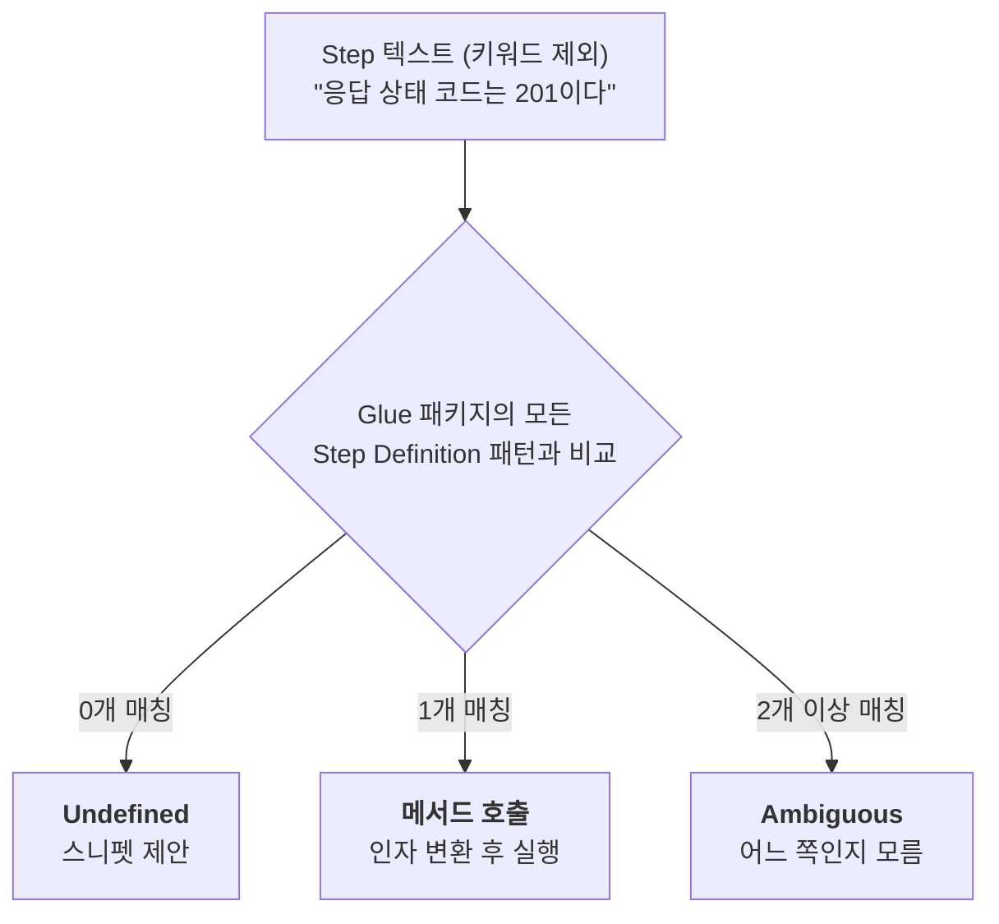

# 04. Step Definition 작성법

> **이 글에서 배울 것**
> - Step Definition이 Gherkin 문장과 연결되는 규칙
> - Cucumber Expression과 내장 파라미터 타입 (`{int}`, `{string}` ...)
> - 선택 텍스트, 대체 텍스트, 정규식, 사용자 정의 파라미터 타입
> - Data Table / Doc String을 받는 방법과 객체 변환 (`@DataTableType`)
> - Step 사이에서 상태(응답, ID 등)를 공유하는 방법
> - 이 프로젝트의 `BookStepDefinitions` 코드 읽는 법
>
> **선수 지식**: [03. Gherkin 심화 문법](gherkin-advanced.md)

---

## 1. Step Definition이란?

Step Definition은 **Gherkin 문장 패턴이 붙은 Java 메서드**입니다.

```java
//      ┌──── 어노테이션: 가독성용 (매칭에는 영향 없음)
//      │      ┌──── Cucumber Expression: 매칭 패턴
//      ▼      ▼
@Then("응답 상태 코드는 {int}이다")
public void 응답_상태_코드는_이다(int expectedStatusCode) {   // {int} -> int 파라미터
    assertThat(lastResponse.getStatusCode().value())
            .as("HTTP 상태 코드")
            .isEqualTo(expectedStatusCode);
}
```

- 어노테이션은 `io.cucumber.java.en` 패키지의 `@Given`, `@When`, `@Then`, `@And`, `@But`을 사용합니다.
- **메서드 이름은 아무렇게나 지어도 됩니다.** Cucumber는 메서드 이름이 아니라 어노테이션 안의 패턴으로 매칭합니다.
  이 프로젝트는 문장을 그대로 옮긴 한글 메서드 이름을 사용해서, 스택 트레이스만 봐도 어떤 Step인지 알 수 있게 했습니다.
- Step Definition 클래스는 **Glue 패키지**(이 프로젝트에서는 `com.example.cucumber`) 아래에 있어야 Cucumber가 찾습니다.
- 클래스에 별도 어노테이션은 필요 없습니다. (`@Component` 등을 붙이지 않습니다.)

---

## 2. 매칭 규칙

Cucumber는 Step 하나를 실행할 때마다 다음을 확인합니다.



- 패턴은 Step 텍스트 **전체**와 일치해야 합니다. (부분 일치 없음)
- 띄어쓰기, 조사, 콜론 하나까지 일치해야 합니다.
- Step 아래에 Data Table이나 Doc String이 있으면 메서드의 **마지막 파라미터**로 추가 전달됩니다.

---

## 3. Cucumber Expression

Cucumber Expression은 정규식보다 읽기 쉬운 Cucumber 전용 패턴 문법입니다.
중괄호 `{}`로 표시한 부분이 **값을 뽑아내는 자리(파라미터)** 입니다.

### 3.1 내장 파라미터 타입

| 파라미터 | 매칭되는 텍스트 | Java 타입 | 이 프로젝트의 예 |
|----------|----------------|-----------|------------------|
| `{int}` | `42`, `-7` | `int` / `Integer` | `응답 상태 코드는 {int}이다` |
| `{long}` | `999999` | `long` / `Long` | `ID {long}로 도서를 조회한다` |
| `{double}` | `29.99`, `-1.5` | `double` / `Double` | `해당 도서 가격을 {double}로 수정한다` |
| `{float}` | `3.14` | `float` / `Float` | |
| `{bigdecimal}` | `35.99` | `BigDecimal` | 금액 처리에 권장 |
| `{biginteger}` | `12345678901234567890` | `BigInteger` | |
| `{byte}`, `{short}` | 정수 | `byte`, `short` | |
| `{word}` | 공백 없는 한 단어 `Clean` | `String` | |
| `{string}` | `"Clean Code"` 또는 `'Clean Code'` | `String` (따옴표 제외) | `등록된 도서 제목은 {string}이다` |
| `{}` | 아무 텍스트 | `String` (또는 기본 변환기로 변환) | |

`{string}`은 **따옴표로 감싼 텍스트**만 매칭하며, 메서드에는 따옴표가 빠진 값이 전달됩니다.

```gherkin
And 등록된 도서 제목은 "Clean Code"이다
```
```java
@Then("등록된 도서 제목은 {string}이다")
public void 등록된_도서_제목은_이다(String expectedTitle) {  // expectedTitle = Clean Code
```

### 3.2 한국어 문장에서의 파라미터

한국어는 숫자 바로 뒤에 조사나 단위가 붙습니다. Cucumber Expression은 이런 경우도 잘 처리합니다.

| 패턴 | 매칭되는 Step |
|------|---------------|
| `도서 목록에 {int}권이 포함되어 있다` | `도서 목록에 3권이 포함되어 있다` |
| `재고가 {int}권인 {string} 도서가 등록되어 있다` | `재고가 5권인 "Domain-Driven Design" 도서가 등록되어 있다` |
| `해당 도서 재고를 {int}으로 수정한다` | `해당 도서 재고를 20으로 수정한다` |

다만 **조사가 달라지면 다른 문장**입니다. `20으로`와 `5로`는 각각 다른 패턴이 필요합니다.
이럴 때 아래의 대체 텍스트를 활용합니다.

### 3.3 대체 텍스트 `/` 와 선택 텍스트 `()`

```java
// 대체 텍스트: "으로" 또는 "로" 둘 다 매칭 (슬래시 양옆에 공백 없이)
@When("해당 도서 재고를 {int}으로/로 수정한다")
```

위 패턴은 `재고를 20으로 수정한다`와 `재고를 5로 수정한다`를 모두 매칭합니다.

```java
// 선택 텍스트: 괄호 안의 텍스트는 있어도 되고 없어도 됨
@Then("도서 목록에 {int}권(이) 포함되어 있다")
```

위 패턴은 `도서 목록에 3권이 포함되어 있다`와 `도서 목록에 3권 포함되어 있다`를 모두 매칭합니다.

### 3.4 특수 문자 이스케이프

`(`, `)`, `{`, `}`, `/`를 글자 그대로 쓰려면 앞에 `\`를 붙입니다. Java 문자열 안이므로 `\\`로 씁니다.

```java
@When("도서 가격을 {int}원\\/권으로 설정한다")      // "원/권" 이라는 글자 그대로
@Then("응답 본문에 \\{\\} 가 포함된다")               // "{}" 라는 글자 그대로
```

---

## 4. 정규식(Regular Expression)

패턴이 `^`로 시작하거나 `$`로 끝나면 Cucumber는 Cucumber Expression이 아니라 **정규식**으로 해석합니다.
캡처 그룹 `( )` 하나가 파라미터 하나가 됩니다.

```java
@Then("^응답 상태 코드는 (\\d+)이다$")
public void 응답_상태_코드는_이다(int expectedStatusCode) { ... }
```

| 비교 | Cucumber Expression | 정규식 |
|------|---------------------|--------|
| 가독성 | 좋음 | 나쁨 |
| 표현력 | 보통 | 강력함 |
| 권장 | **기본으로 사용** | 표현이 정말 불가능할 때만 |

---

## 5. 사용자 정의 파라미터 타입 (`@ParameterType`)

자주 쓰는 값의 형식을 이름 붙여 재사용할 수 있습니다.

```java
public class ParameterTypes {

    // "성공" 또는 "실패"를 boolean으로 변환하는 {outcome} 파라미터
    @ParameterType(value = "성공|실패", name = "outcome")
    public boolean outcome(String value) {
        return "성공".equals(value);
    }

    // ISBN 형식만 매칭하는 {isbn} 파라미터
    @ParameterType(value = "[0-9-]{10,17}", name = "isbn")
    public String isbn(String value) {
        return value;
    }
}
```

```java
@Then("도서 등록에 {outcome}한다")
public void 도서_등록_결과(boolean success) {
    int expected = success ? 201 : 400;
    assertThat(lastResponse.getStatusCode().value()).isEqualTo(expected);
}
```

```gherkin
Then 도서 등록에 성공한다
Then 도서 등록에 실패한다
```

- `@ParameterType` 메서드도 Glue 패키지 안에 있어야 합니다.
- `name`을 생략하면 메서드 이름이 파라미터 이름이 됩니다.
- 도메인 용어를 파라미터 타입으로 만들면 시나리오의 어휘가 통일되는 효과가 있습니다.

---

## 6. Data Table 받기

### 6.1 `DataTable` 그대로 받기 (이 프로젝트의 방식)

```java
@Given("다음 도서들이 등록되어 있다:")
public void 다음_도서들이_등록되어_있다(DataTable dataTable) {
    List<Map<String, String>> rows = dataTable.asMaps(String.class, String.class);
    for (Map<String, String> row : rows) {
        BookRequest request = new BookRequest(
                row.get("title"), row.get("author"), row.get("isbn"),
                new BigDecimal(row.get("price")), Integer.parseInt(row.get("stock"))
        );
        ...
    }
}
```

간단하지만 `Map` → 객체 변환 코드가 Step마다 반복된다는 단점이 있습니다.

### 6.2 `@DataTableType`으로 객체로 바로 받기

변환 규칙을 한 번만 정의해두면, Step Definition이 객체 리스트를 바로 받을 수 있습니다.

```java
public class DataTableTypes {

    @DataTableType
    public BookRequest bookRequest(Map<String, String> row) {
        return new BookRequest(
                row.get("title"),
                row.get("author"),
                row.get("isbn"),
                new BigDecimal(row.get("price")),
                Integer.parseInt(row.get("stock"))
        );
    }
}
```

```java
@Given("다음 도서들이 등록되어 있다:")
public void 다음_도서들이_등록되어_있다(List<BookRequest> books) {   // DataTable 대신 List<BookRequest>
    books.forEach(this::registerBook);
}
```

- 가로형(헤더 + 행) 테이블에서 각 행이 `Map<String, String>`으로 변환 메서드에 전달됩니다.
- 세로형(키-값) 테이블을 같은 방식으로 받고 싶다면 파라미터에 `@Transpose`를 붙여 표를 뒤집을 수 있습니다.
  (`public void x(@Transpose List<BookRequest> books)`)

---

## 7. Doc String 받기

```gherkin
When 다음 JSON으로 도서 등록을 요청한다:
  """json
  { "title": "Clean Code", ... }
  """
```

```java
@When("다음 JSON으로 도서 등록을 요청한다:")
public void 다음_JSON으로_도서_등록을_요청한다(String body) { ... }

// 콘텐츠 타입(json)까지 필요하면
@When("다음 JSON으로 도서 등록을 요청한다:")
public void 다음_JSON으로_도서_등록을_요청한다(DocString docString) {
    String type = docString.getContentType();   // "json"
    String body = docString.getContent();
}
```

(두 메서드를 동시에 두면 Ambiguous 오류가 나므로 하나만 선택하세요.)

---

## 8. Step 사이의 상태 공유

`When`에서 보낸 요청의 응답을 `Then`에서 검증하려면, 응답을 어딘가에 저장해야 합니다.

### 8.1 인스턴스 필드 (이 프로젝트의 방식)

```java
public class BookStepDefinitions {

    private ResponseEntity<String> lastResponse;   // When이 저장, Then이 읽음
    private Long savedBookId;                      // Given이 저장, When이 읽음

    @Given("{string} 도서가 등록되어 있다")
    public void 도서가_등록되어_있다(String title) {
        ...
        savedBookId = ...;                         // 저장
    }

    @When("해당 도서를 삭제한다")
    public void 해당_도서를_삭제한다() {
        lastResponse = execute(() -> restClient.delete()
                .uri("/api/books/{id}", savedBookId)   // 사용
                ...);
    }

    @Then("응답 상태 코드는 {int}이다")
    public void 응답_상태_코드는_이다(int expected) {
        assertThat(lastResponse.getStatusCode().value()).isEqualTo(expected);   // 사용
    }
}
```

**필드가 다른 Scenario로 새어나가지 않을까?** 걱정하지 않아도 됩니다.
Cucumber는 **Scenario마다 Step Definition 클래스의 인스턴스를 새로 만듭니다.**
(`cucumber-spring` 사용 시 Step Definition 클래스는 Scenario 범위의 Spring 빈으로 생성됩니다.)
그래서 Scenario A에서 저장한 `savedBookId`는 Scenario B에서 보이지 않습니다.

> 이 프로젝트의 `@Before setUp()`에서 `lastResponse = null` 로 초기화하는 코드는 그래서 사실 필수는 아닙니다.
> 의도를 명확히 드러내기 위한 방어 코드입니다.

### 8.2 여러 Step Definition 클래스가 상태를 공유해야 할 때

Feature가 많아지면 Step Definition 클래스를 도메인별로 나누게 됩니다.
(예: `BookStepDefinitions`, `CommonResponseStepDefinitions`)
이때 "응답"처럼 공통으로 쓰는 상태는 **Scenario 범위 빈**으로 분리해 주입받습니다.

```java
// src/test/java/com/example/cucumber/support/ScenarioContext.java
@Component
@ScenarioScope                         // io.cucumber.spring.ScenarioScope: Scenario마다 새 인스턴스
public class ScenarioContext {
    private ResponseEntity<String> lastResponse;

    public ResponseEntity<String> lastResponse() { return lastResponse; }
    public void lastResponse(ResponseEntity<String> response) { this.lastResponse = response; }
}
```

```java
public class BookStepDefinitions {
    @Autowired ScenarioContext context;

    @When("전체 도서 목록을 조회한다")
    public void 전체_도서_목록을_조회한다() {
        context.lastResponse(execute(() -> restClient.get().uri("/api/books").retrieve().toEntity(String.class)));
    }
}

public class CommonResponseStepDefinitions {
    @Autowired ScenarioContext context;

    @Then("응답 상태 코드는 {int}이다")
    public void 응답_상태_코드는_이다(int expected) {
        assertThat(context.lastResponse().getStatusCode().value()).isEqualTo(expected);
    }
}
```

> **하지 말아야 할 것**: `static` 필드로 상태를 공유하는 것. Scenario 간에 값이 남아서 순서에 따라 결과가 달라지는 테스트가 됩니다.

---

## 9. 좋은 Step Definition의 조건

| 원칙 | 설명 |
|------|------|
| **얇게(Thin)** | Step Definition은 "번역기"입니다. 복잡한 로직은 헬퍼 메서드나 별도 클래스로 옮깁니다. 이 프로젝트의 `execute()`, `parseBody()`, `generateIsbn()`이 그 예입니다. |
| **Then에서만 검증** | Given/When에서 `assertThat`을 하면 실패 원인이 "준비 실패"인지 "결과 오류"인지 헷갈립니다. 단, Given의 준비가 실패했다면 즉시 예외를 던지는 것은 좋습니다. |
| **재사용 가능한 문장** | `응답 상태 코드는 {int}이다`처럼 파라미터화하면 여러 Scenario에서 재사용됩니다. |
| **기술 세부사항 숨기기** | URL, JSON 경로, HTTP 메서드는 Step Definition 안에만 존재해야 합니다. Gherkin에는 드러나지 않게 합니다. |
| **Feature 파일과 1:1로 묶지 않기** | Step Definition은 전역입니다. 어떤 Feature에서든 같은 문장이면 같은 메서드가 호출됩니다. 클래스는 Feature가 아니라 **도메인 개념** 기준으로 나눕니다. |

---

## 10. 이 프로젝트의 `BookStepDefinitions` 읽는 법

`src/test/java/com/example/cucumber/steps/BookStepDefinitions.java`는 다음 구역으로 나뉘어 있습니다.

| 구역 | 내용 | 볼 포인트 |
|------|------|-----------|
| 필드 | `port`, `bookRepository`, `lastResponse`, `savedBookId`, `restClient` | `@LocalServerPort`, `@Autowired`가 동작하는 이유는 Spring 빈으로 생성되기 때문 ([05장](project-architecture.md)) |
| `@Before setUp()` | `RestClient`를 랜덤 포트로 생성 | Hook도 Step Definition 클래스 안에 둘 수 있음 |
| 공통 헬퍼 | `execute()`, `parseBody()`, `generateIsbn()` | `execute()`는 4xx/5xx 응답도 예외 대신 `ResponseEntity`로 받게 해 Then에서 상태 코드를 검증할 수 있게 함 |
| Background | `도서 데이터베이스가 초기화되어 있다` | API가 아니라 Repository로 직접 DB 정리 |
| 등록 / 조회 / 수정 / 삭제 | Given, When Step | When은 항상 결과를 `lastResponse`에 저장 |
| Then: 검증 | 상태 코드, 응답 본문 필드 검증 | 모든 검증은 AssertJ `assertThat` |

---

## 11. 미구현 Step과 스니펫

Feature에 새 문장을 쓰고 실행하면, Cucumber는 매칭되는 메서드가 없다고 알려주면서 **스니펫(코드 뼈대)** 을 제안합니다.

```
You can implement this step using the snippet(s) below:

@When("가격이 {double}인 도서를 등록하려 한다")
public void 가격이_인_도서를_등록하려_한다(Double double1) {
    // Write code here that turns the phrase above into concrete actions
    throw new io.cucumber.java.PendingException();
}
```

- 스니펫을 복사해 Step Definition 클래스에 붙이고, 파라미터 이름과 내용을 채우면 됩니다.
- `PendingException`은 "아직 구현 중"이라는 표시입니다. 이 상태의 Step은 **pending**으로 리포트됩니다.
- IntelliJ의 Cucumber for Java 플러그인을 쓰면 Feature 파일에서 `Alt+Enter`(macOS: `Option+Enter`) → **Create step definition**으로 같은 작업을 할 수 있습니다.

---

## 확인 문제

<details>
<summary>Q1. <code>@Given("{string} 도서가 등록되어 있다")</code>는 <code>Given Clean Code 도서가 등록되어 있다</code>와 매칭될까요?</summary>

**매칭되지 않습니다.** `{string}`은 따옴표로 감싼 텍스트만 매칭합니다. `Given "Clean Code" 도서가 등록되어 있다`로 써야 합니다.
</details>

<details>
<summary>Q2. 다음 두 Step Definition이 동시에 있으면 <code>When ID 5로 도서를 조회한다</code>는 어떻게 될까요?</summary>

```java
@When("ID {long}로 도서를 조회한다")
@When("ID {int}로 도서를 조회한다")
```

두 패턴 모두 매칭되므로 **Ambiguous** 오류가 발생합니다. 둘 중 하나를 삭제해야 합니다.
</details>

<details>
<summary>Q3. Scenario A에서 <code>savedBookId = 10</code>을 저장했습니다. 다음 Scenario B의 첫 Step에서 <code>savedBookId</code>의 값은?</summary>

`null`입니다. Scenario마다 Step Definition 인스턴스가 새로 만들어지기 때문입니다.
</details>

---

| 이전 글 | 목차 | 다음 글 |
|:---|:---:|---:|
| [← 03. Gherkin 심화 문법](gherkin-advanced.md) | [학습 로드맵](../README.md#학습-로드맵) | [05. 프로젝트 구조와 실행 원리 →](project-architecture.md) |
